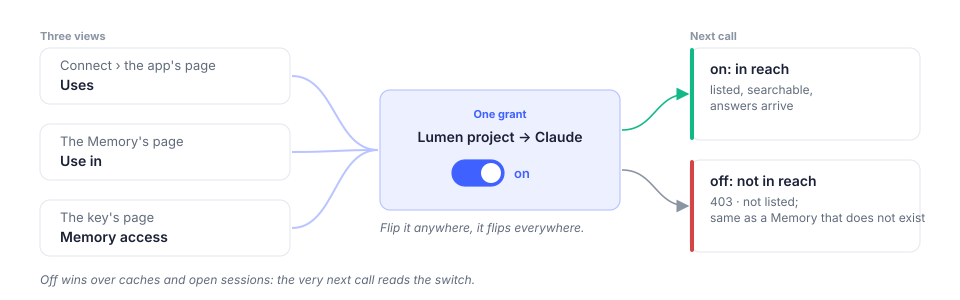

# Authentication & Scopes

Every request to `https://api.app.membase.io` carries one header:

```
Authorization: Bearer <credential>
```

There is no API-wide key, no client secret and no signature. The credential itself says who
the caller is, which Memories it may touch, and what it may do to them. Both kinds of
credential are minted by the account's owner and can be narrowed or revoked by them at any
time; the change applies on the credential's next call.

## The two credentials

| | Developer key | Consent token |
|---|---|---|
| Minted by | the owner, under **Connect › Developer keys** | the owner, approving an app on the OAuth consent screen |
| Held by | code the owner runs: a script, a server, an SDK, an AI running the skill | an AI app: Claude, ChatGPT, Cursor, Codex, Grok, Kimi… |
| Shape | `mbk_<key id>_<token>`, shown once; the key's page keeps a hint such as `mbk_7f3a92d1…c91e` | opaque; the app stores it |
| Access | **Read**, **Read & write** or **Full access**, chosen at creation and changeable in place | read-only, always |
| Reach | the Memories ticked on the key, or *all, including later ones* | the Memories ticked on consent |
| Profile | when **Your profile** is ticked | when **Let it know about you** is ticked |
| Can confirm a removal | yes, with `confirm=true` | never |
| Expires | never, 30 days, 90 days or a year | with the app's grant; the app refreshes it |

Which one you need: if your code holds the credential, a developer key. If the user's AI app
holds it, consent through MCP, and your code never sees a token at all. The
[Connect your AI](https://noah-gao.gitbook.io/membase-user-guide/connect) tab is the consent path; the rest of this page is
mostly about keys.

## Access levels

A level is a set of operations. Each level adds to the one before it.

| Level | Grant | Operations |
|---|---|---|
| **Read** | `read` | `list_containers`, `search_memories`, `get_profile` (with the profile tick), `list_documents`, `get_document`, `memory_rules`, `ask_agent` |
| **Read & write** | `suggest` | Read, plus `add_memory`, `add_document` |
| **Full access** | `manage` | Read & write, plus `delete_document`, `forget_memory`, each only with `confirm=true` |

`ask_agent` answers only for a credential that exposes an agent (a marketplace subscription,
for example); an ordinary key holds no agent, and the call is refused with `403` like any
verb outside its grant. `workflow_invoke` belongs to workflow exposures and is not on any
key. The [API reference](api-reference.md) lists the same table
from the tool table itself, so it is the one to trust when they differ.

A call above the key's level is refused with `403` and `code: unauthorized`, and the key's
page counts it as a *refused* call. The level can be raised or lowered on the key's page
without re-minting; the token stays the same and the next call reads the new grant.

## Reach

Reach is the list of Memories (containers, in the API) a credential may use. It is switched
on the Connect page, on the key's page under **Memory access**, or on a Memory's own page under
**Use in**; all three are the same switch. A key created with *All memories, including ones
you make later* reaches every container the account has now or later.



A container outside the reach is refused exactly like one that does not exist: `403`,
`code: unauthorized`, *may not use that container*. `list_containers` never lists it, so a
client cannot tell withheld from absent. With exactly one container in reach the `container`
field may be omitted on `add_memory`; with more than one it is required.

## The profile tick

The profile is the standing facts the assistant keeps about the person: `static` (who they
are, lasting preferences) and `dynamic` (what changed recently). It is not part of any
container, so reach does not cover it. A credential reads it with `get_profile` only when the
owner ticked **Your profile** on the key or **Let it know about you** on consent. Without the
tick the operation is not offered at all.

## Destructive operations

`delete_document` and `forget_memory` need Full access, and even then they do not run on
their own: a call without `confirm=true` answers `200` with

```json
{ "status": "confirmation_required", "verb": "delete_document", "how": "…" }
```

and the `how` sentence is what to relay to the person. Pass `confirm=true` only after they
agreed; from a developer key that counts as the owner's confirmation. A consent token can
never confirm, so from an AI app the answer is always the sentence.

## Expiry, rotation, revocation

* **Expiry** is chosen at creation and cannot be extended. An expired key answers `403` with `code: unauthorized`, and its row moves to **Expired**.
* **Rotate…** mints a new key with the same level, reach and expiry and asks what to do with the old one. By default the old one keeps working until you revoke it, so you can swap the value in your environment first.
* **Revoke…** ends a key at once. Every holder of the token fails on its next call. The key stays listed under **Revoked** for thirty days so you can see what it was.
* **Disconnect…** on an app's page revokes every consent token that app holds. Removing the connector inside the app does not tell Membase; revoke on Connect to be sure.

Revocation and permission changes apply to subsequent requests. They do not remove content
already received or stored by an external client.

## What a wrong credential looks like

| Answer | Meaning |
|---|---|
| `401` | no bearer at all |
| `403 · unauthorized` | an unknown, expired or revoked token; a container outside the reach; a verb above the level. The message says which. |
| `403 · unauthorized · not in this agent's capability profile` | the verb is above the key's level |
| `403 · unauthorized · may not use that container` | the container is outside the reach, or does not exist |

The status is `403` and not `401` for a bad token on purpose: the request was authenticated
as *some* caller (the key id is in the token) and that caller is not allowed. Only a request
with no bearer is `401`.

## Managing keys from code

Keys are managed with the owner's own session, the credential the Membase app holds after
sign-in, and never with a developer key: a key cannot mint, widen or revoke another key. The
screen for the same operations is [Connect › Developer keys](https://noah-gao.gitbook.io/membase-user-guide/use/manage-your-memory/connect#developer-keys).

| Call | Does |
|---|---|
| `POST /v1/api-keys` | mint a key: name, level, container list or `all_views`, profile tick, `expires_in_days` |
| `PATCH /v1/api-keys/{id}` | change its name, level, profile tick or all-containers reach; the next call reads the new grant |
| `PATCH /v1/exposures/{id}/views` | change its container list |
| `GET /v1/api-keys/{id}/usage` | calls per day, refusals, per tool, the last twenty |
| `DELETE /v1/exposures/{id}` | revoke it, at once |

## OAuth, for an app that connects over MCP

The MCP server at `https://api.app.membase.io/mcp-http` advertises its authorization the
standard way, so any MCP client that speaks OAuth connects without a Membase-specific step:

1. An unauthenticated request answers `401` with a `WWW-Authenticate` pointing at the protected-resource metadata (`/.well-known/oauth-protected-resource`, RFC 9728).
2. The metadata names the authorization server and its registration endpoint; the client registers itself dynamically (RFC 7591) and starts the authorization code flow with PKCE.
3. The browser opens Membase's consent screen. The owner ticks the Memories the app may use and whether it may read their profile, and approves.
4. The client receives a token good for exactly that. `tools/list` on that token offers `list_containers`, `search_memories` and, when ticked, `get_profile`, nothing that writes.

A client that cannot do OAuth sends a developer key in the same `Authorization` header
instead, and gets the key's level.

## Keep the token out of the open

* Read the key from the environment (`MEMBASE_API_KEY`), never from source.
* Log the hint from the key's page, never the token.
* Do not put a key in a config file you commit or publish; the ready-made client configs Membase serves carry no header for that reason.
* One key per thing that holds it, named after it, so a revocation stops one thing.
