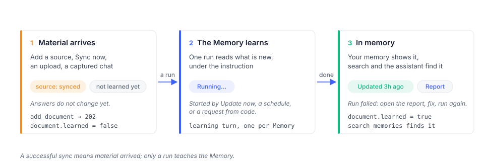

# How Membase works

This page describes the behavior an integration needs to handle: learning from documents,
searching memory, choosing a model and checking access.

## Accounts and Memories

Each account owns its Memories, sources and access settings. In the API, a `container` is
one Memory within that account. Use the account owner's credentials and select the appropriate
container; do not use containers as isolation boundaries between different users.
[Multi-user isolation](multi-user-isolation.md).

## Material becomes memory in a learning turn

A **Memory** has an instruction describing what to retain and sources containing material
to process. Adding or syncing a source does not mean the Memory has learned its contents.

Select **Update now** in the app or configure a schedule to process sources. The API's
`add_document` also requests learning and returns `202`; this acknowledges acceptance, not
completed learning. Check the document's `learned` flag before searching for the new content.
If processing fails, resolve the reported issue and update the Memory again.
[Memory operations](memory-operations.md).

## A search is a turn

`search_memories` retrieves relevant passages from the selected Memories. Each result names
its container. `ask_agent` returns an agent's answer and is available only to credentials
that expose an agent.

- **Allow time for startup and retrieval.** A request after inactivity can take longer.
  The SDKs default to a 90-second timeout; some requests may need longer.
- **Check partial failures.** An HTTP `200` can still contain `containers[].error`. Do not
  report an empty search as “nothing found” until you have checked those errors.
- **Use the supported search fields.** Search accepts `q`, an optional `container` and a
  `limit`. Metadata filters are not supported; include relevant constraints in the query.

See [API troubleshooting](troubleshooting.md) for timeouts and unavailable Memories.

## The profile

The profile holds information about the user separately from topic-specific Memories.
`static` contains lasting information and preferences; `dynamic` contains recent context.
Read it with `get_profile` when the credential grants profile access. Use `add_memory` with
`static=true` to add profile information.

## Models

Learning, hosted search and assistant replies require an available model. The account owner
configures supported providers or subscriptions in **AI Setup** and selects the assistant's
model source in its settings.

When a model is unavailable, stored memory remains, but learning or search may fail. A turn
can return `422` with `code: capability_unavailable`; search may instead report an error for
each affected Memory in `containers[].error`. A document can remain unread until the issue
is resolved and learning completes. A free-plan account may report `reason: dormant` after
its free allowance is used. Follow the returned recovery guidance.

## Access and confirmation

Developer keys have an access level, selected Memories and an expiry. MCP consent grants
read access to the Memories the owner approves. Profile access is a separate setting.
Changes to permissions apply to subsequent requests using the credential.

`delete_document` and `forget_memory` require Full access and `confirm=true`. Obtain the
owner's confirmation before submitting either operation. Revoking a credential prevents
future access through it; it does not erase results already received by an external client.
[Authentication and access](authentication.md) describes the permission rules.

## Where to go next

| Task | Guide |
|---|---|
| Make a first call | [Quickstart](api-quickstart.md) |
| Add, retrieve or remove content | [Memory operations](memory-operations.md) |
| Look up an operation | [API reference](api-reference.md) |
| Map the app to API concepts | [App and API concepts](platform-overview.md) |
| Connect an AI app | [Connect your AI](https://noah-gao.gitbook.io/membase-user-guide/connect) |
| Review engine evaluation results | [Benchmarks](https://noah-gao.gitbook.io/membase-user-guide/evaluation/benchmarks) |
