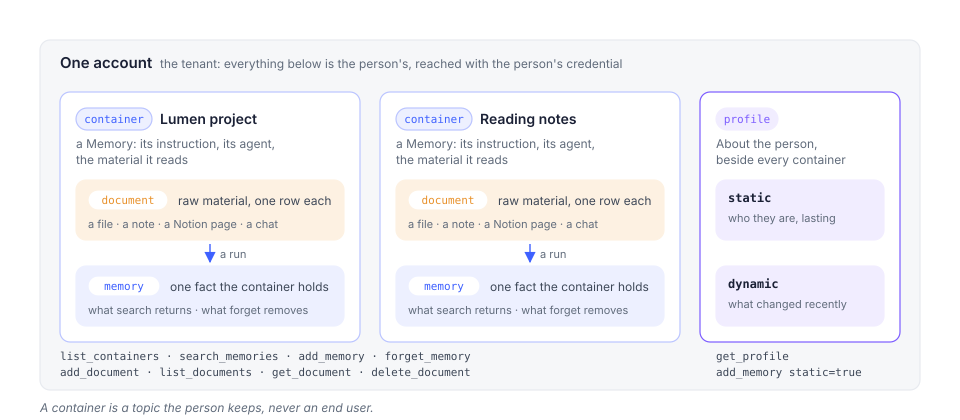

# App and API concepts

The Memory Platform is the hosted Membase at `https://www.app.membase.io`. A person hands it
material once; it keeps a living memory of that material; every AI they connect, and every
key they mint, reads the same memory. The mechanism is on
[How Membase works](how-membase-works.md); this page is the product around it, written for
someone whose code will meet what the person sees. The screens themselves, one page each,
are in the **Use Membase** tab.

## The three nouns

| API | In the app | What it is |
|---|---|---|
| **container** | a *Memory* | one named space of memory, with the agent that keeps it and the material it reads |
| **memory** | an item on a Memory's page | one fact the container holds, or one fact of the user's profile |
| **document** | a row under a Memory's sources | one piece of raw material a container read: a file, a note, a page |

Plain verbs: `list`, `search`, `get`, `add`, `delete`, `forget`, `ask`.
[Memory operations](memory-operations.md) walks them; the [API reference](api-reference.md)
has every operation.

A **profile** sits beside the containers: the standing facts the assistant keeps about the
user (`static`) and the most recently changed ones (`dynamic`). `get_profile` reads it;
`add_memory` with `static=true` writes to it.

## The screens

| Screen | The person uses it to | Your code meets it as |
|---|---|---|
| [Home](https://noah-gao.gitbook.io/membase-user-guide/use/use-your-assistant/home) | talk to the assistant, the one agent that is theirs by default; reach it on Telegram | the profile it keeps, and the assistant's own memory, always the first container |
| [Memory](https://noah-gao.gitbook.io/membase-user-guide/use/manage-your-memory/memory) | make, run and inspect Memories | `list_containers`, `search_memories`, the items `forget_memory` removes; `learned` turning true after a run |
| [Files](https://noah-gao.gitbook.io/membase-user-guide/use/bring-your-material-in/files) | keep files, and hand folders, uploads, Notion pages and captured conversations to a Memory | `add_document`, `list_documents`, `get_document`, `delete_document` |
| [Studio](https://noah-gao.gitbook.io/membase-user-guide/use/advanced/studio) | edit a Memory's pipeline canvas | nothing; a canvas run as an endpoint is `workflow_invoke` over MCP |
| [Agents](https://noah-gao.gitbook.io/membase-user-guide/use/advanced/agents) | build agents beyond the assistant | `ask_agent` on an agent-endpoint credential |
| [Schedules](https://noah-gao.gitbook.io/membase-user-guide/use/automate-and-troubleshoot/schedules) | run Memories on a cadence | `learned` turning true without a call of yours |
| [Activity](https://noah-gao.gitbook.io/membase-user-guide/use/automate-and-troubleshoot/activity) | see what ran | the run a `202` from `add_document` started; a key's own calls are on the key's page |
| [AI Setup](https://noah-gao.gitbook.io/membase-user-guide/use/account-and-models/ai-setup) | choose the account's model | `422 · capability_unavailable` when there is none |
| [Connect](https://noah-gao.gitbook.io/membase-user-guide/use/manage-your-memory/connect) | let an AI app read Memories, mint keys | consent tokens and developer keys: [Authentication & Scopes](authentication.md) |
| [Marketplace](https://noah-gao.gitbook.io/membase-user-guide/use/share-and-trade/marketplace) | sell and buy access to a Memory | subscriptions, `ask_agent` |
| [Settings](https://noah-gao.gitbook.io/membase-user-guide/use/account-and-models/settings) | plan, export, delete | `422 · reason: dormant` on a free plan whose turns are spent |

## Credentials

Every call carries a bearer: a **developer key** the owner minted, or a **consent token** an
app received on the OAuth consent screen. A key has a level (Read, Read & write, Full
access), a reach (the Memories it may use) and an expiry; a consent token is read-only and
reaches what the user ticked. Both are managed by the account owner in **Connect**. [Authentication & Scopes](authentication.md) has the whole model; the keys
screen is under [Connect](https://noah-gao.gitbook.io/membase-user-guide/use/manage-your-memory/connect#developer-keys) in the user guide.

A key's calls are on the key's page, not on Activity: **Usage** (calls in the last 30 or 7
days, how many were *refused*, the tool it calls most) and **Recent activity** (each call:
tool, Memory, what came back, when; a refused call in red with the reason). The same numbers
are on `GET /v1/api-keys/{id}/usage` with the owner's session.

## One account per person

The account is the tenant. A container is a topic, not an end user. A product that serves
many people gives each of them their own Membase account, and reads their memory with their
own key or their own consent; there are no application-wide keys and no sub-tenant tags.
[Multi-user isolation](multi-user-isolation.md) has the patterns.

## Models

Every learning turn, every search and every assistant answer needs a model. The account
chooses it under AI Setup: a key of its own for a provider, or a Claude or ChatGPT
subscription. Follow the connection and verification steps shown in **AI Setup**. An account with no working model keeps
its stored memory, but learning and hosted search need working agent turns. A search may
return per-Memory failures in `containers[].error`; documents can remain unread.
[How Membase works](how-membase-works.md#models).

## Limits and errors

Search can report per-Memory failures in `containers[].error` on an HTTP `200`. Check that
field before treating an empty result as “nothing found.” [API troubleshooting](troubleshooting.md)
covers partial failures, deferred learning and timeouts.

| Status | Code | When |
|---|---|---|
| 400 | `validation` | a missing `q`, both `content` and `url`, an ambiguous `container` |
| 403 | `unauthorized` | outside the credential's reach, or a verb above its level |
| 404 | `not_found` | an unknown document or memory id |
| 422 | `capability_unavailable` | the account's memory cannot run a turn here (no agent container, no model) |
| 422 | `reason: dormant` | a free-plan account whose free turns are spent |
| 429 | `rate_limited` | the account's concurrent-turn budget; retry later |

Uploads through `add_document` are bounded by the account's plan (32 MiB per file on the
current plans). An account on the free plan whose free turns are spent keeps its memory but
cannot run turns until it brings a model of its own under AI Setup or moves to a paid plan.

## Marketplace

A listing may provide a memory snapshot, live access to a Memory, or an agent endpoint.
An agent-endpoint credential uses `ask_agent`; snapshot and live-memory purchases have
different access and renewal rules. Check the listing type and its **Included access**
section. [Marketplace](https://noah-gao.gitbook.io/membase-user-guide/use/share-and-trade/marketplace).

## Stopping and undoing

Revoking a key or disconnecting an app changes subsequent access. It does not erase content
already received by the client. Pausing a schedule stops future scheduled runs; subscription
changes follow the terms and dates shown for that purchase or plan.

Deleting a Memory removes its stored content. Deleting a conversation removes the transcript
but retains information already saved to memory. Deleting account data retains the sign-in
identity. Review the confirmation and export data you want to keep before deleting.
[How Membase fits together](https://noah-gao.gitbook.io/membase-user-guide/concepts#stopping-and-undoing).
