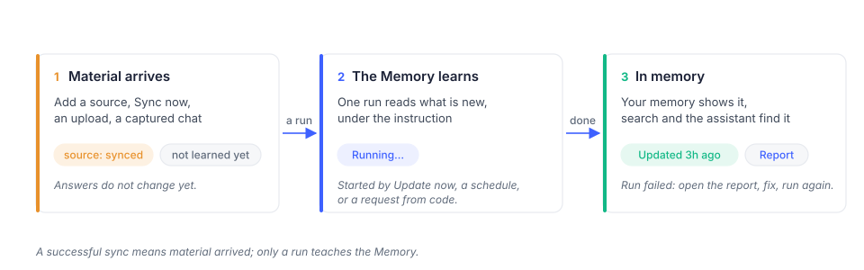

# Bring your material in

Choose the source that fits your material. Files, uploads, Notion and captured conversations
feed a Memory through its Add card; the Memory learns from them when you run it. Talking to
your assistant follows a different path: it can save what matters during the conversation.

| Way in | Good for | Where |
|---|---|---|
| A folder in your Files | a project, a vault, anything already on disk | memory page › Add card › **Your Files › Choose** |
| Upload | a handful of files | memory page › Add card › **Upload Files › Upload** |
| [Notion](notion.md) | pages and databases | memory page › Add card › **Notion** (where available) |
| [Browser extension](browser-extension.md) | your chats with other assistants | memory page › Add card › **Unibase Memory** |
| Talking to your assistant | what you tell it, decide with it, ask it | Home, or Telegram |

## A folder in your Files

Press **Choose** on *Your Files*. The Files browser opens inside the dialog: browse, tick one or
more folders, and confirm in the footer. The folder is read in place, so anything you later add
to it is picked up on the memory's next run. A folder the memory already reads says *reading*.

If the files are not in your Files yet, put them there first from the Files page, or upload.

## Upload

Press **Upload** on *Upload files* and drop the files. They land in a folder with the memory's
name at the top of your Files, which is connected as a source on the spot. Markdown, text and
the common document formats are accepted; the dialog tells you before sending if a file is not.

## Notion

Connect a workspace, select the pages or databases the Memory should read, and add them.
A sync fetches those pages; the Memory still needs a run to learn from them. Follow the
[Notion guide](notion.md) for authorization, page selection, updates and disconnection.

## Unibase Memory

The Unibase Memory browser extension captures your conversations with other assistants and
hands them to a memory as a source.

1. Press **Install** on *Unibase Memory*. Once the extension is connected, the same door says
   **Use here**.
2. Press **Use here**. The door says *Reading* and the source appears in the Add card.
3. Select **Update now**.

A memory over your conversations keeps memory about *you*: what you asked, decided, adopted. It
does not restate what an assistant explained. Its instruction is a filter on the chats, not a
subject: *unibase* keeps what the chats say that bears on Unibase, not a description of Unibase.

## Talking to your assistant

Your assistant can retain relevant information from conversations on Home or Telegram.
A *Saved to memory* indication shows when information has been saved. Review the assistant's
memory on the Memory page; do not assume every message has been stored as a memory entry.

The [browser extension guide](browser-extension.md) covers setup and missing conversations.

## Then run

After adding a source, select **Update now** on the Memory page or configure a schedule
in **Settings**. See [Memory](../pages/memory.md).
