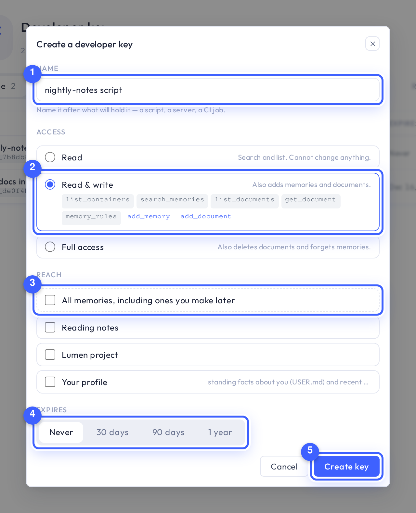
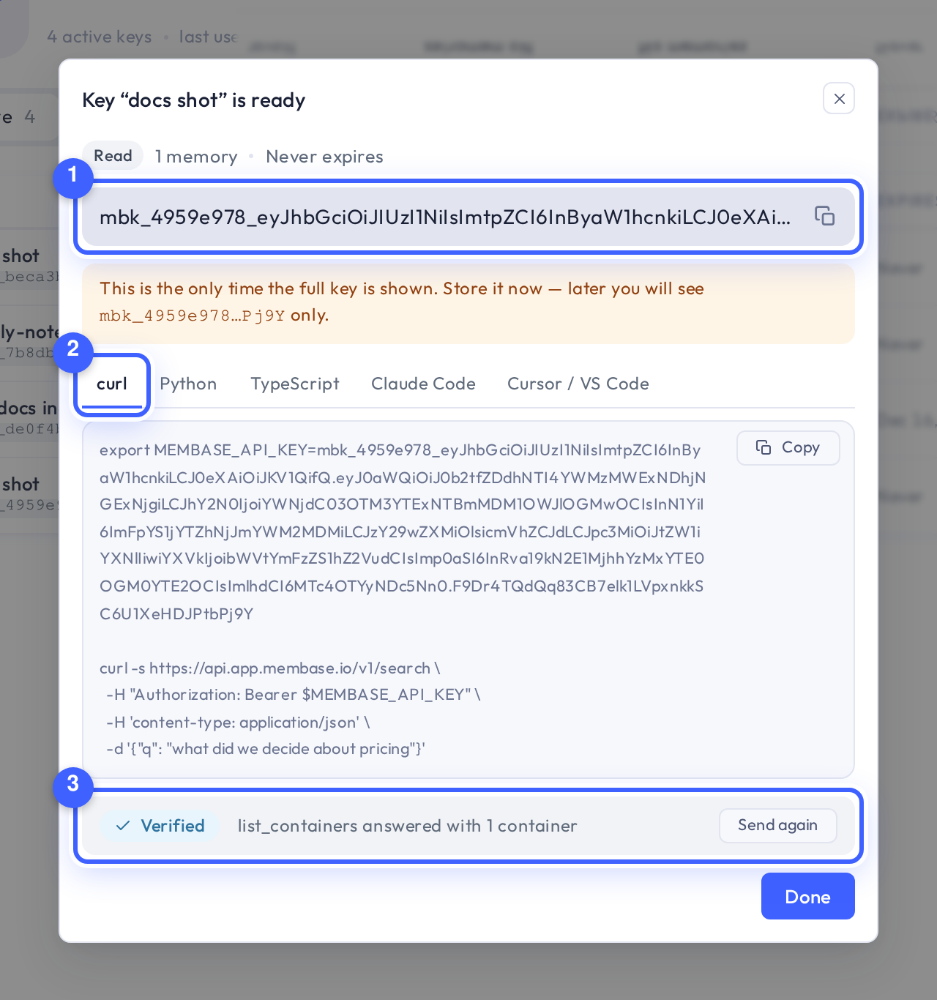
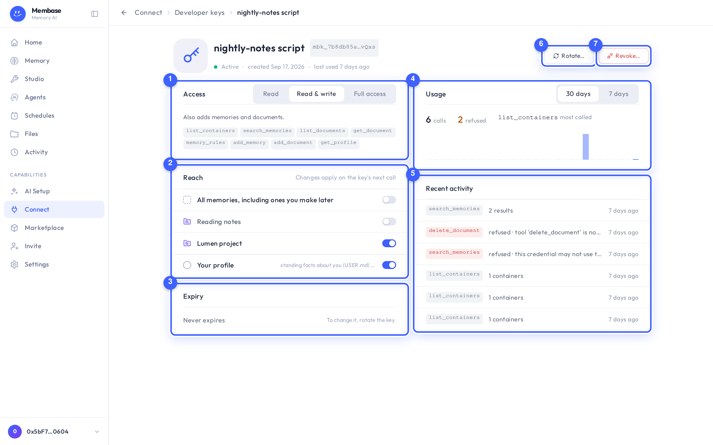

# Use your memory from code

A **developer key** is your own credential for a script, a server or an SDK. It reaches your
memory the way a connected app does — the same tools, over the memories you choose — at an
access level you pick, for as long as you say, and you can change, rotate or revoke it on its
own page at any time.

Connected apps (Claude, ChatGPT, Cursor…) do not need one: they connect through
[Connect](../pages/connect.md) and approve on the consent screen. A developer key is for code
you run yourself.

## Where keys live

Open **Connect**. Under the apps, the **Your own code** group holds one tile, **Developer
keys** — it says how many keys are active and when one was last used. It opens the keys page.


Every key is one row: its name and hint, its access, what it reaches, when it expires, when it
was last used. **Active**, **Expired** and **Revoked** are the three segments; a key that has
stopped working stays listed for 30 days so you can see what it was. **Create key** (1) makes
one; the name (2) opens the key's page; the **⋯** (3) at the end of a row holds **Rotate…**
and **Revoke…**.

## Create a key



1. **Name** (1) it after what will hold it, for example *nightly-notes script*.
2. Pick the **Access** (2). The level you pick shows the tools it gets:
   - **Read** — search and list. It cannot change anything.
   - **Read & write** — also adds a memory or a document.
   - **Full access** — also deletes a document or forgets a memory. Each of those calls must
     still say `confirm=true`; a key never removes anything on its own.
3. Pick the **Reach** (3). Nothing is ticked to begin with. Tick the memories it may use, or
   **All memories, including ones you make later**. **Your profile** — the standing facts your
   assistant keeps about you and what changed recently — is the last row of the list.
4. Pick when it **Expires** (4): never, 30 days, 90 days or a year.
5. Press **Create key** (5).



The token (1) appears once, in full. Store it now: afterwards the app shows only its hint,
such as `mbk_7f3a92d1…c91e`, which is enough to tell your keys apart and never enough to use
one.

The same screen gives the token in six shapes (2) — **Tell your AI** (the one sentence that
makes an AI install Membase with this key, see [Connect](../pages/connect.md#tell-your-ai)), a
`curl` call, Python, TypeScript, the Claude Code command, and the `mcp.json` block Cursor and
VS Code read — and **Send a test call** (3) makes one real call with the new key from your
browser and reports what came back: *Verified*, and how many memories the key can see.

## Use it

**In Claude Code**, so that Claude Code reads your memory without an OAuth round-trip:

```bash
claude mcp add --transport http --scope user membase https://api.app.membase.io/mcp-http \
  --header "Authorization: Bearer YOUR_KEY"
```

**From a script**, over HTTP:

```bash
export MEMBASE_API_KEY=YOUR_KEY
curl -s https://api.app.membase.io/v1/search \
  -H "Authorization: Bearer $MEMBASE_API_KEY" -H 'content-type: application/json' \
  -d '{"q": "what did we decide about pricing in August"}'
```

The API's words map onto the app's:

| In the app | In the API |
|---|---|
| a Memory | a **container** |
| an entry on a Memory's page | a **memory** |
| a file, note or page a Memory read | a **document** |

The complete reference — every call, field and answer — is
[docs/contract/agent-protocol.md](https://github.com/unibaseio/membase-suites/blob/main/docs/contract/agent-protocol.md)
in the repository, and the `membase` plugin (`plugin/`) teaches it to any AI client.

## A key's page



Open a key from the list. Its page has everything about it:

- **Access** (1) — change the level with the segmented control; the tools it now holds are
  listed under it. The change applies on the key's next call; the token stays the same.
- **Reach** (2) — a switch per memory, one for *All memories, including ones you make later*,
  and one for *Your profile*. Off takes effect on the key's next call.
- **Expiry** (3) — when the token stops working. It cannot be extended; to change it, rotate.
- **Usage** (4) — calls in the last 30 or 7 days, how many were **refused** (the key asked for
  a memory or a verb it does not have), and the tool it calls most.
- **Recent activity** (5) — the last calls one by one: tool, memory, what came back, when. A
  refused call is red and says why.

Click the name to rename the key.

## Rotate and revoke

**Rotate…** (6) makes a new key with the same access, reach and expiry, and asks what to do
with the current one. By default it keeps working until you revoke it, so you can swap the value in
your environment first; or revoke it on the spot.

**Revoke…** (7) ends a key at once: every script holding the token fails on its next call. The
dialog shows the key's hint and warns when the key was used in the last week — a key used
today is probably still in something. A revoked key stays listed under **Revoked** for 30
days.

Which memories a key reaches can also be switched on the memory's own page: under **Use in**,
keys are listed after the apps.

## If something looks wrong

| It says | What it means | Do |
|---|---|---|
| `403 … may not use that container` | the key does not reach that memory | switch the memory on for the key on its page |
| `403 … not in this agent's capability profile` | the call is above the key's access | raise the level on the key's page |
| `"status": "confirmation_required"` | a delete or forget without `confirm=true` | say `confirm=true` after you have decided; only a developer key can |
| `422 … no model` | your memory cannot run a turn yet | set a model under [AI Setup](../pages/ai-setup.md) |
| *refused* in Recent activity | the key asked for something it does not have | the row says which memory or verb; adjust Reach or Access |
| *Expired* on the row | the token's day has passed | **Rotate…** was the moment; now create a similar key from **⋯** |
| *in 6 days* on the row (amber) | the key expires within a week | **Rotate…** and swap the value |
