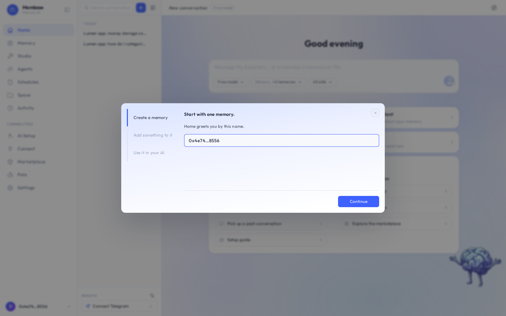
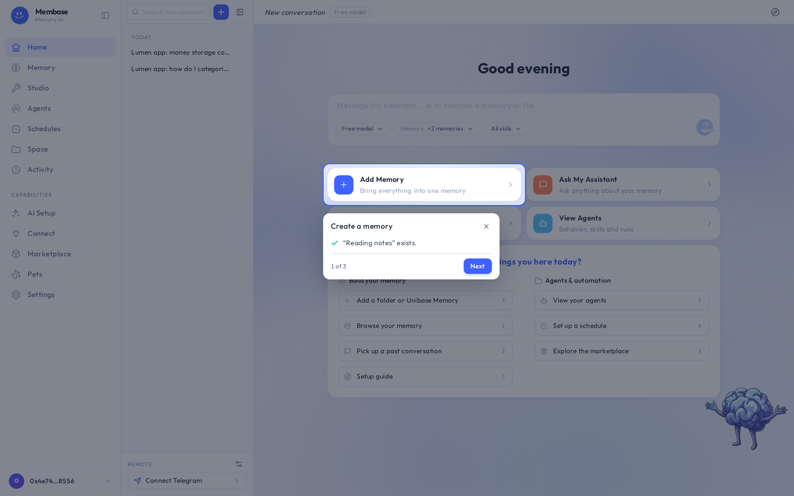

# The first-run guide

On a new account the product dims the page and lights the one control to press next. That is the
**Setup guide**. It has three steps, the same three this documentation uses:

1. Create a memory
2. Add something to it
3. Use it in your AI

The guide opens on a name card. Press **Continue** and the first real control lights up, with a
small card beside it saying what to do.

A few things worth knowing:

- The guide follows *you*. It reads your account every few seconds; a step you have already done
  says so and **Next** moves on.
- A step you have not done holds until you do it. You can close the guide any time with the X
  on its card.
- It opens by itself once per browser session on an account that has none of the three. After
  that, the **Setup guide** button at the top right of Home, or the *Setup guide* row in the
  starter panel, starts it again from the name card.
- On a page without the step's control, the card stands at the corner with one door to the right
  page.
