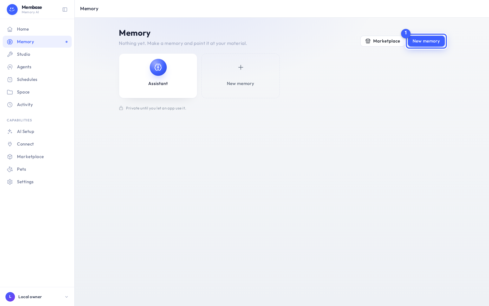
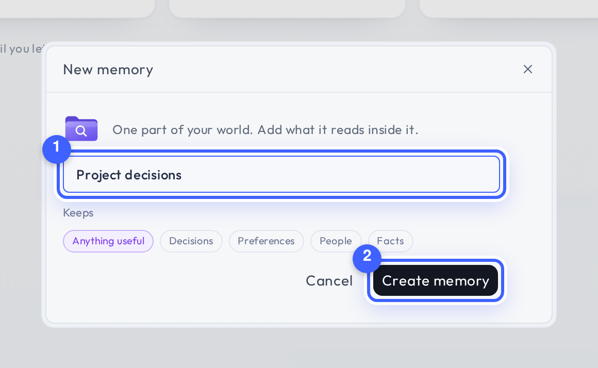
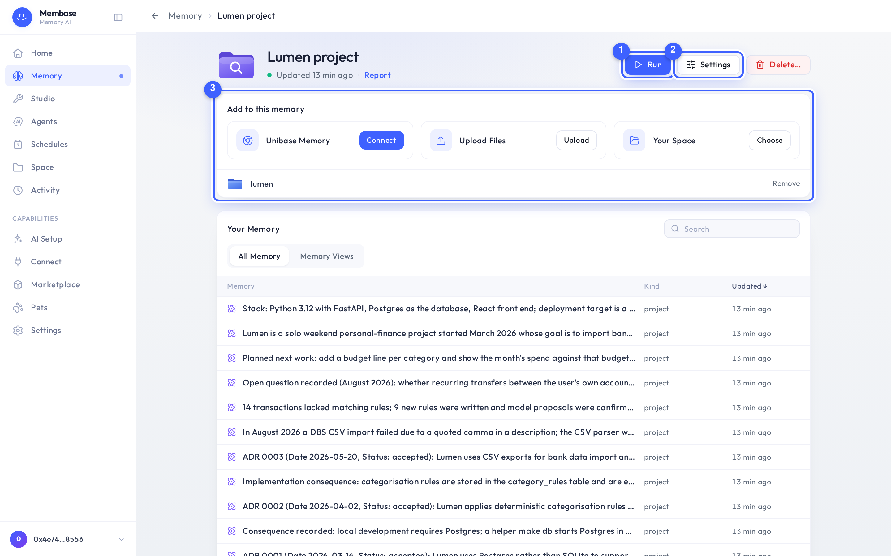

# 5-minute quickstart

By the end of this page Claude can answer questions about a project folder of yours, and you
will have seen where each answer came from.

You need: a Membase account, a folder of Markdown or text files, and a Claude account.

## 1. Create a memory

1. Open **Memory** in the left rail. Before you have any, the page shows only the Assistant's
   own memory.
2. Press **New memory** ①.

3. Give it a name ①. Under *Keeps*, leave **Anything useful** or pick a preset. Press
   **Create memory** ②.

You are on the memory's page. Its hero shows the name, a **Run** button that is still disabled,
**Settings** and **Delete…**.

## 2. Add something to it

The **Add to this memory** card ③ has three doors: Unibase Memory, Upload Files and Your Space.

1. Press **Choose** on *Your Space*. The Space browser opens inside the dialog.
2. Tick the folder that holds your project files and confirm in the footer. If your files are
   not in Space yet, press **Upload** on *Upload Files* instead; they land in a folder with the
   memory's name.
3. The Add card now lists the folder. A toast tells you adding does not run the memory.
4. Press **Run** ① in the hero. The status line under the name says *Running…*, then
   *Updated just now · Report*.

> Nothing is read until you press **Run** or a schedule fires. The button says **Update now**
> whenever a source holds material this memory has not read yet.

## 3. Use it in your AI

1. Open **Connect** in the left rail. Apps you have not connected show as dashed tiles.

2. Pick **Claude** ①. The connector URL and the steps for Claude unfold under the tiles.

3. Follow those steps in Claude. The last one sends you back to Membase to approve access and
   tick the memories Claude may read. Tick the memory you just made and press **Approve access**.
4. Back in Claude, ask a question about your project. Claude reaches for your memory on its own.

The Claude tile is now solid and says *Connected*. Its page lists the memory under **Uses**, with
a switch you can turn off at any time.

The same memory answers on Home, too. Ask your assistant and it tells you which page it read:

## What next

- [Keep it up to date on a schedule](../tasks/schedule-updates.md)
- [Use it in ChatGPT too](../tasks/use-in-chatgpt.md)
- [Import your chats with other assistants](../tasks/import-conversations.md)
