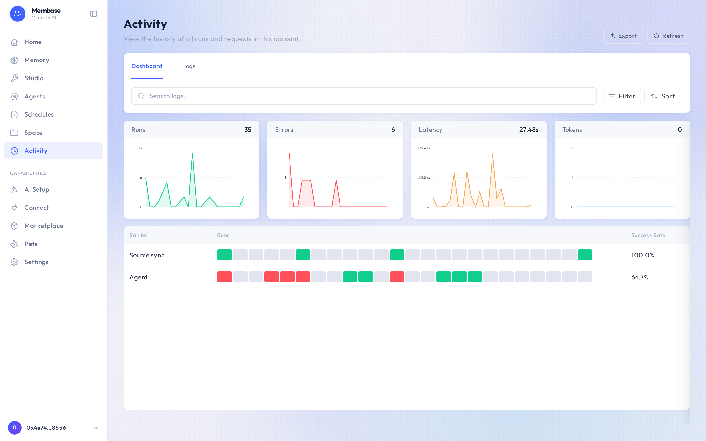

# Activity

A human-readable timeline of what ran: memory runs, syncs, scheduled tasks, agent turns.

A scheduled run's result stays on its run record here and on Schedules, and is sent to the
Telegram chat when one is bound to the assistant.
