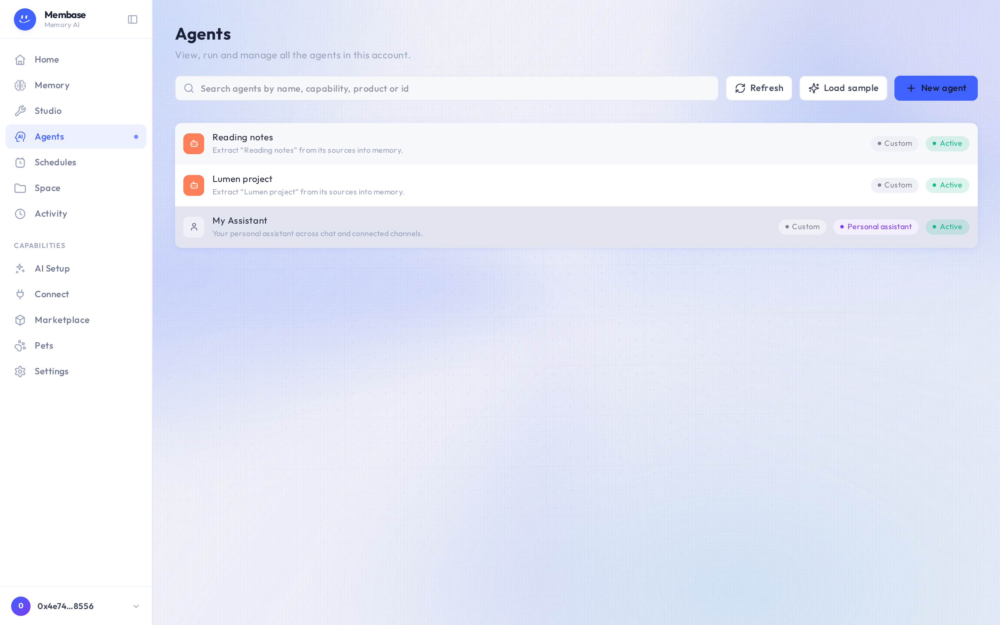

# Agents

The agents you build, beyond the assistant.

One row per agent: its endpoint, permissions, tools, and **Revoke**. AI apps reading your
memories are not agents; they live on Connect. Most accounts never need this page.
