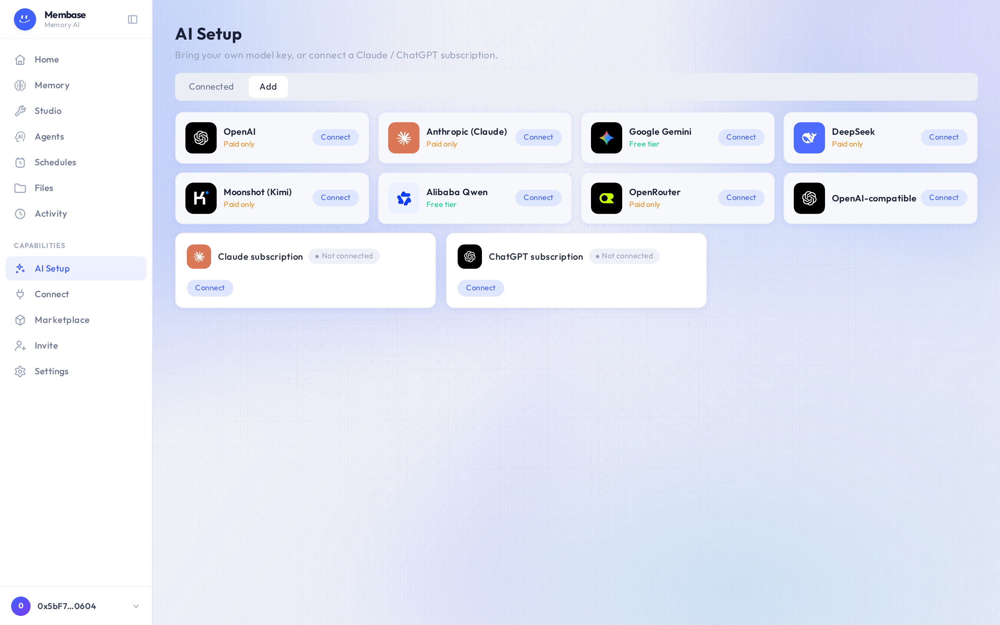

# AI Setup

AI Setup is where the account's model comes from.

Two ways in:

- **Bring your own key** for a provider (OpenAI, Anthropic, Gemini, DeepSeek, Kimi, Qwen,
  OpenRouter, or any OpenAI-compatible endpoint). Press **Connect**, paste the key, pick a model
  from the list the key returns. A key with no model is not saved.
- **A Claude or ChatGPT subscription.** Press **Connect** on the subscription card and sign in
  with that provider. Turns are then billed to the subscription.

The **Connected** tab lists what you have set up; one of them is the account's **active**
source. The active source answers everything that is not an agent turn. Which source *the
assistant* runs on is the assistant's own field, in its settings on Home.

## Verify

Each connection is verified with one short real request before it is used. A key that fails
verification is never used, and the row says why.

## If something looks wrong

Look up the word on screen.

| It says | What it means | Do |
|---|---|---|
| *Not connected* on a subscription card | you have not signed in with that provider | **Connect** and finish the provider's sign-in |
| a failure reason on a key's row | the one test request with that key did not succeed; the key is not used | check the key and the model, **Connect** again |
| everything works except agent turns | the account's active source is set, the assistant's own model source is not | Home › assistant chip › Model card |

