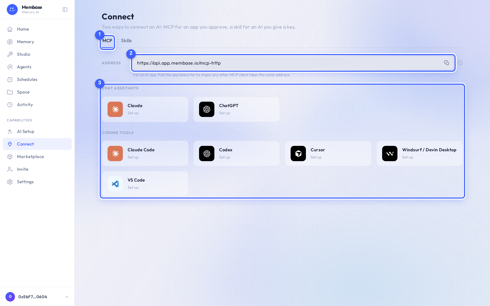
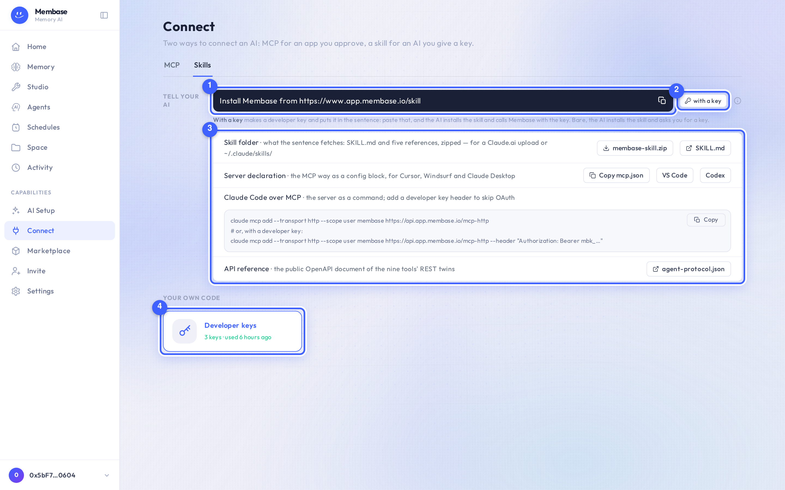
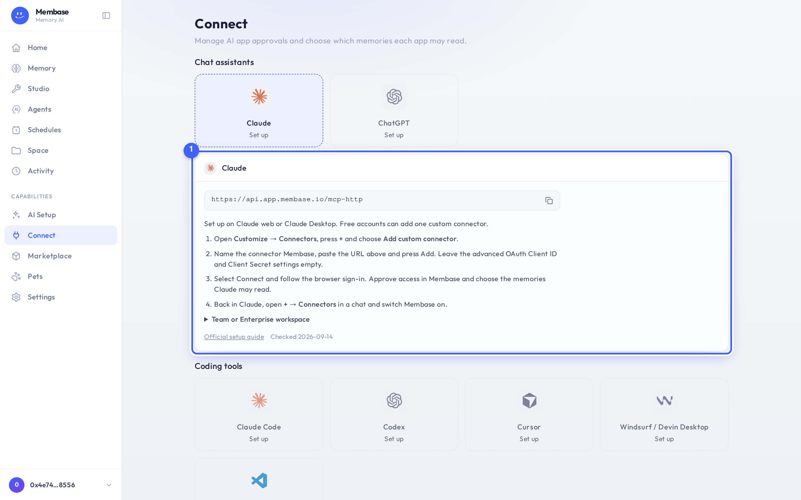
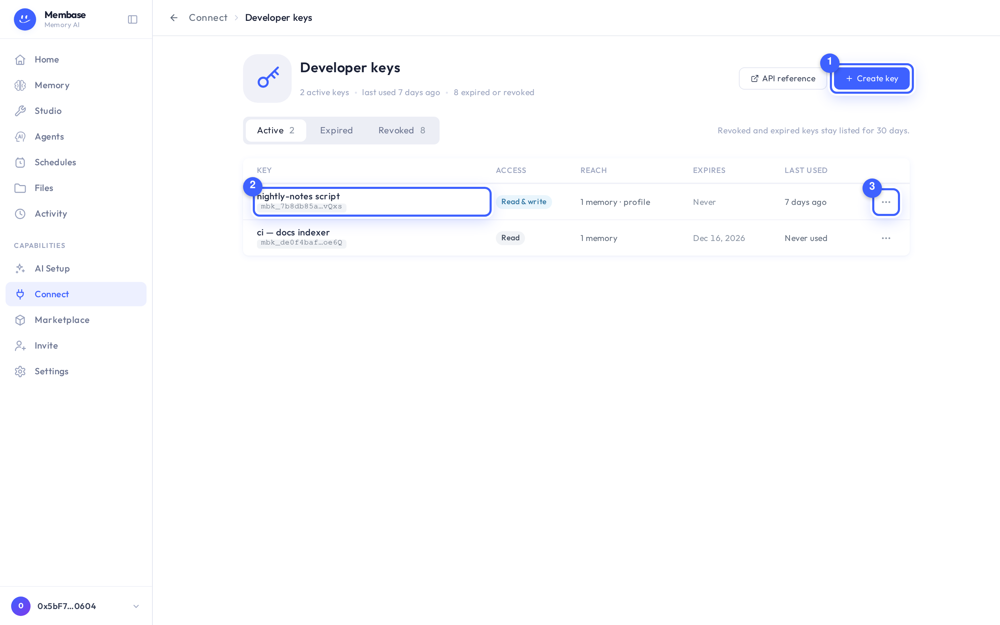

# Connect

Connect is where an AI gets permission to read your memories. There are two ways to connect an
AI, and the page has a tab for each.

1. **The tabs.** **MCP** is for an AI app; **Skills** is for an AI that reads pages and runs
   commands. Each tab holds everything its way needs.
2. **The address** (MCP tab). Copy it into the app's connector or MCP settings; the app opens
   your browser and you approve it on the consent card, ticking the memories it may read. An
   app connected this way can only read.
3. **The client catalog, by purpose.** *Chat assistants* and *Coding tools*. A dashed tile says
   *Set up* and unfolds that app's steps; a solid tile says *Authorized* and opens the app's
   page.

The **Skills** tab:

1. **Tell your AI.** One sentence — *Install Membase from https://www.app.membase.io/skill*.
   Pasted to an AI that runs commands (Claude Code, Codex, Cursor, Windsurf…), it installs the
   Membase skill and asks you for a key.
2. **With a key** makes a developer key for the AI and hands you the sentence with the key
   inside (*… using key mbk_…*). Paste that instead, and the AI installs the skill, keeps the
   key, and calls Membase directly with it at the access you chose — without asking.
3. **Setup files**: the raw material for hands that cannot run commands — the skill folder as a
   zip (for a Claude.ai upload or `~/.claude/skills/`), the `mcp.json` server block Cursor,
   Windsurf and Claude Desktop read, the VS Code and Codex snippets, the Claude Code command,
   and the public API reference.
4. **Developer keys** — the skill way's credentials, and any key you use from your own
   scripts. The tile opens the keys page.

## The skill way, step by step

1. Press **with a key**. The **A key for your AI** dialog is the ordinary Create key dialog,
   pre-filled: name *my AI*, access **Read & write**. Tick the memories it may reach and press
   **Create key**.
2. The token screen opens on **Tell your AI**: the sentence with the key inside. Copy it.
3. Paste it to your AI. It reads the page at that address — the skill's own SKILL.md, which
   begins with install steps — fetches the skill folder (SKILL.md and five references), stores
   the key where its shell will find it, then lists the memories it may use over the API and
   tells you the result. An empty list means no memory is switched on for it yet: open the
   memory and switch it on under **Use in**.

The key is a normal developer key: it appears under **Developer keys**, where you change its
reach or access, see what the AI has been calling, and revoke it. The skill never adds an MCP
server; if the same AI is also connected over MCP, it uses those tools and keeps the skill for
its rules.

## Set an app up by hand

Picking a dashed tile unfolds the connector URL and the steps for that app:

1. **The steps.** Written for that app's own menus. Follow them in the app; the last one brings
   you back here to approve access and tick the memories the app may read.

## An app's page

Once connected, the tile opens the app's page: the hero (name, *Authorized · last activity*), a
**Uses** card with one row per memory and its switch, and, when there is more than one approval,
an **Approvals** card with a **Revoke** per credential. **Disconnect…** in the hero revokes every
approval at once.

> Connecting is the account's, once. Which memories an app uses is the memory's, and the switch on
> the app's page and the switch on the memory's *Use in* card are the same switch.

## What the app can do

A connected app gets two tools: list the memories it may use, and search them. It cannot see
memories you have not switched on for it, and it cannot tell that they exist. Turning a switch
off takes effect on the app's very next question. If you ticked **Let it know about you** when
approving, it also gets your profile — the standing facts your assistant keeps about you and
what changed recently. An app can never add, delete or forget anything.

## Developer keys

Under the apps, the **Your own code** group holds the **Developer keys** tile: your own
credentials for a script, a server or an SDK. It opens a page of its own, one key per row —
name and hint, access (**Read**, **Read & write** or **Full access**, which may also delete a
document or forget a fact, and even then only when the call says so explicitly), reach, expiry
and last use. **Create key** makes one and shows the token once; a key's page changes its
access and reach in place, shows what it has been doing, and rotates or revokes it. The
walkthrough is [Use your memory from code](../getting-started/developer-keys.md).

Removing the connector inside Claude or ChatGPT does not tell Membase. To be sure access has
stopped, open the app's page here and **Disconnect…**.

## If something looks wrong

Look up the word on screen.

| It says | What it means | Do |
|---|---|---|
| *Set up* | this app is not connected | pick the tile and follow the steps |
| *Uses nothing yet* (amber) | connected, but no memory switched on | turn a switch on under **Uses** |
| the app cannot see a memory | its switch is off | memory page › **Use in** |
| I removed the app in Claude but it still shows *Authorized* | the app did not tell Membase | **Disconnect…** on the app's page |
| *The MCP address is unavailable* | the page could not ask the server for it | reload; the sentence for your AI still works |
| my AI installed the skill but says it has no access | the skill needs a developer key | Skills tab › **with a key**, and paste the sentence to the AI |
| a key's row says *Expired* | its token has lapsed | **⋯ › Create a similar key** on the Developer keys page |
| the Developer keys tile says *For scripts and SDKs* | you have no active key | open it and press **Create key** |

