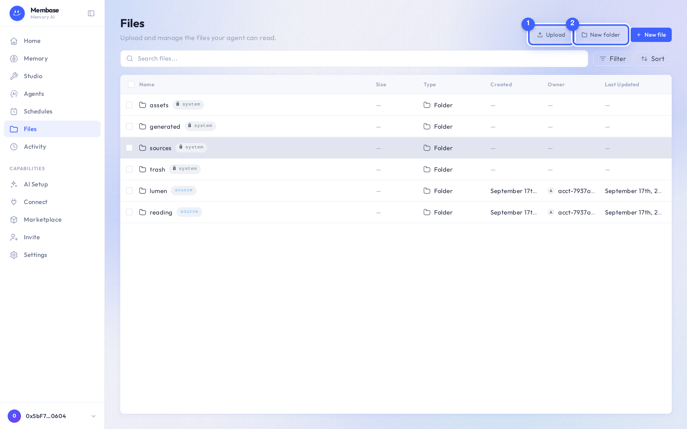

# Files

Files is your files: a real folder tree the assistant shares with you.

1. **Upload.** Files land in the folder you are in.
2. **New folder.** Any folder can later become a source.

The root is your own tree. The locked system folders *Generated*, *Assets* and *Trash* sit
beside it. Browsing never wakes the memory; only a memory's run reads files.

Right-click a row for rename, move, delete and download. Deleted files go to *Trash* first.

## Making a folder a source

You do not do it here. Open the memory that should read the folder and press **Choose** on
*Your Files* in its Add card. The same browser opens inside the dialog, with a footer that
connects the ticked folders. A folder the memory already reads says *reading*.
