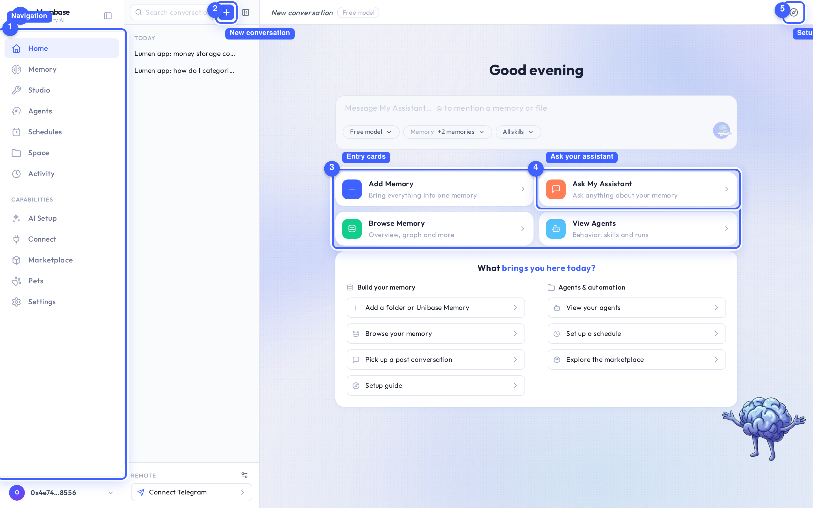
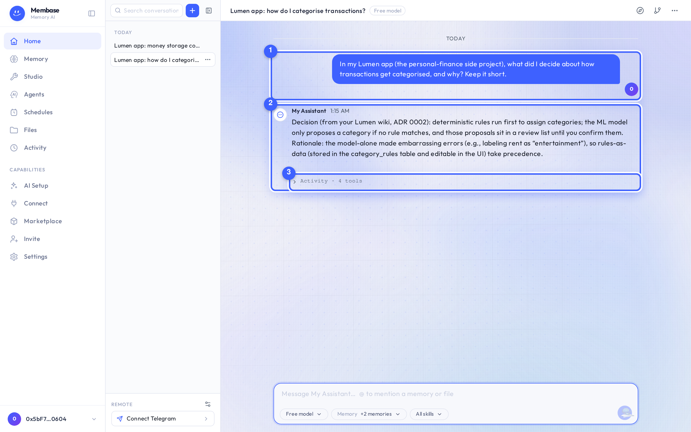

# Home

Home is your conversation with the Assistant. Everything else in the product feeds this page.

1. **Navigation.** The left rail. Flat items first, then a *Capabilities* group.
2. **New conversation.** Starts a draft row at the top of the rail. The first message turns it
   into the real conversation.
3. **Entry cards.** Add Memory, Ask My Assistant, Browse Memory, View Agents. Shortcuts to the
   three things a new account does first.
4. **Ask your assistant.** Opens the conversation box. Enter sends, Shift+Enter breaks a line.
5. **Setup guide.** Replays the first-run guide from its name card.

## The conversation rail

The rail lists your conversations grouped by day: Today, Yesterday, Previous 7 days, Older.
Each row's menu offers **Rename**, **Branch** and **End**. Ended conversations fold away at the
bottom; they stay readable and the assistant can still search them, but they take no more turns.
Their menu offers **Forget**, which asks for confirmation.

At the foot of the rail, **Remote** holds the assistant's Telegram chat. **Connect Telegram**
opens the binding flow; once bound, the row opens a read-only view of that chat. See
[Reach your assistant on Telegram](../tasks/telegram.md).

## The box

The three things you change mid-conversation sit along the bottom edge of the box: the model
source, the memories to consult, and the skills. Send is at the right.

| Key | Does |
|---|---|
| Enter | send |
| Shift+Enter | new line |
| ↑ | recall your last question |
| Esc | stop the current reply |
| ⌘⇧O | new conversation |

## The transcript

1. **Your message.** In a bubble on the right, beside your account disc.
2. **The answer.** Rendered under the assistant's mark and name. When it comes from your
   memory, the assistant says so and names the page it read.
3. **Activity.** Folded under the answer: which tools ran, including the memory it recalled.

Day separators replace a time on every line. Hovering a message shows **Copy**, **Retry**,
**Edit & resend** and **Branch**. Under an answer you may also see memory traces such as
*Saved to memory* or *Recalled an earlier conversation*. A *New reply* pill appears when an
answer lands while you have scrolled up.

## Assistant settings

The assistant chip in the header (name · model) opens its settings as a dialog over the
conversation. One scroll, no tabs, every field saved as it changes: the model card (which source
answers and which model), name, instructions, memories, skills, and its Telegram chat.

## Three verbs

| Verb | Effect | Reversible |
|---|---|---|
| **New** | opens a conversation | – |
| **End** | closes it; still readable and searchable | no more turns |
| **Forget** | deletes the transcript here and in the assistant | **no** |
