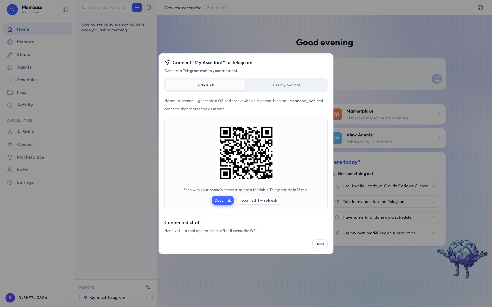

# Home

Home is your conversation with the Assistant. Everything else in the product feeds this page.

1. **Navigation.** The left rail. Flat items first, then a *Capabilities* group.
2. **New conversation.** Starts a draft row at the top of the rail. The first message turns it
   into the real conversation.
3. **Entry cards.** Add Memory, Ask My Assistant, Browse Memory, View Agents. Shortcuts to the
   three things a new account does first.
4. **Ask your assistant.** Opens the conversation box. Enter sends, Shift+Enter breaks a line.
5. **Setup guide.** Replays the first-run guide from its name card.

## The conversation rail

The rail lists your conversations grouped by day: Today, Yesterday, Previous 7 days, Older.
Each row's menu offers **Rename**, **Branch** and **End**. Ended conversations fold away at the
bottom; they stay readable and the assistant can still search them, but they take no more turns.
Their menu offers **Forget**, which asks for confirmation.

At the foot of the rail, **Remote** holds the assistant's Telegram chat. **Connect Telegram**
opens the binding flow; once bound, the row opens a read-only view of that chat. See
[Telegram](#telegram) below.

## The box

The three things you change mid-conversation sit along the bottom edge of the box: the model
source, the memories to consult, and the skills. Send is at the right.

| Key | Does |
|---|---|
| Enter | send |
| Shift+Enter | new line |
| ↑ | recall your last question |
| Esc | stop the current reply |
| ⌘⇧O | new conversation |

## The transcript

1. **Your message.** In a bubble on the right, beside your account disc.
2. **The answer.** Rendered under the assistant's mark and name. When it comes from your
   memory, the assistant says so and names the page it read.
3. **Activity.** Folded under the answer: which tools ran, including the memory it recalled.

Day separators replace a time on every line. Hovering a message shows **Copy**, **Retry**,
**Edit & resend** and **Branch**. Under an answer you may also see memory traces such as
*Saved to memory* or *Recalled an earlier conversation*. A *New reply* pill appears when an
answer lands while you have scrolled up.

## Assistant settings

The assistant chip in the header (name · model) opens its settings as a dialog over the
conversation. One scroll, no tabs, every field saved as it changes: the model card (which source
answers and which model), name, instructions, memories, skills, and its Telegram chat.

## Telegram
Your assistant can live in a Telegram chat as well as on Home. The same memory answers in both
places, and anything a schedule produces is delivered to that chat.

### Connect

1. On Home, look at the foot of the conversation rail, under **Remote**. Press
   **Connect Telegram**.
2. In the dialog, keep **Scan a QR** and press **Generate QR**.

3. Scan the QR with your phone's camera, or press **Copy link** and open the link in Telegram.
   Either way Telegram opens the Membase bot with a one-time code already filled in; send it.
4. Back in the dialog press **I scanned it — refresh**. The chat appears under
   **Connected chats**, and the **Remote** row on Home now opens that chat.

The code is single-use, valid for 15 minutes and tied to your account. Nothing is connected
until the bot actually receives it from your phone.

#### Your own bot

If you would rather not share the Membase bot, pick **Use my own bot**. Create a bot with
@BotFather in Telegram (send it `/newbot`), paste the bot token the dialog asks for, then generate
the QR the same way. The optional **Webhook secret token** is for operators who run their own
webhook and can be left empty.

### What the chat can do

- **Talk to the assistant.** Ask anything you would ask on Home. It reads the same memories and
  keeps the same instructions.
- **Receive scheduled results.** When a memory or agent on a schedule finishes a run, its result
  is sent to this chat. There is nothing to configure.
- **Read it on Home.** The **Remote** row opens a read-only view of the Telegram chat, so what
  you said on your phone is there when you are back at your desk.

The Telegram chat is its own conversation. It does not appear in the day-grouped list on Home,
and Home's conversations do not appear in Telegram; the memory is what they share.

### Disconnect

Open the dialog again from the **Remote** row (the ⚙ beside it) and press **Delete** next to the
chat under **Connected chats**. The bot stops answering that chat at once. Scheduled results
stop being delivered there too, and stay on the Schedules and Activity pages.

## Three verbs

| Verb | Effect | Reversible |
|---|---|---|
| **New** | opens a conversation | – |
| **End** | closes it; still readable and searchable | no more turns |
| **Forget** | deletes the transcript here and in the assistant | **no** |

## If something looks wrong

Look up the word on screen.

| It says | What it means | Do |
|---|---|---|
| *Membase Intelligence is off* | no model source | **AI Setup › Connect** a key or a subscription |
| the reply spins | first reply after a quiet period wakes the assistant | wait; if it does not land, **Retry** |
| *New reply* pill | an answer landed while you scrolled up | click it |

