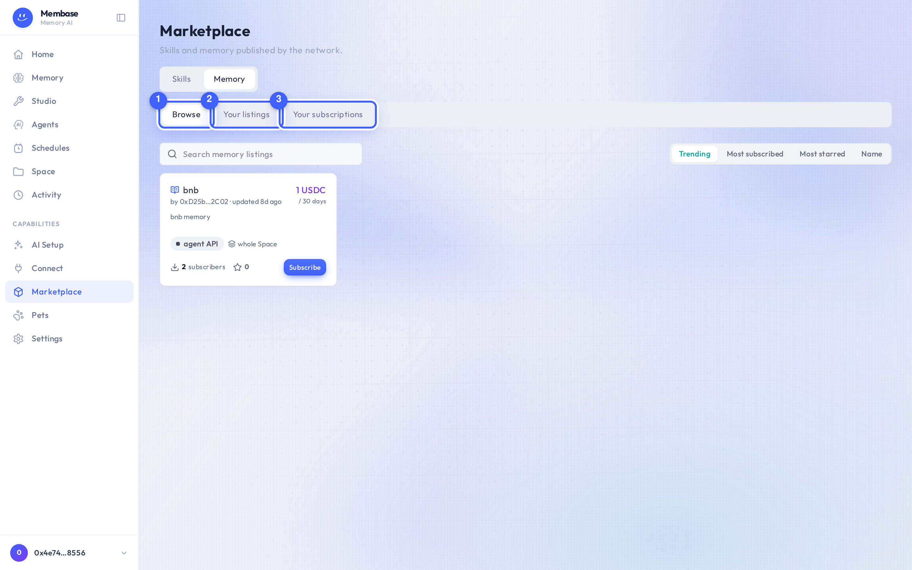
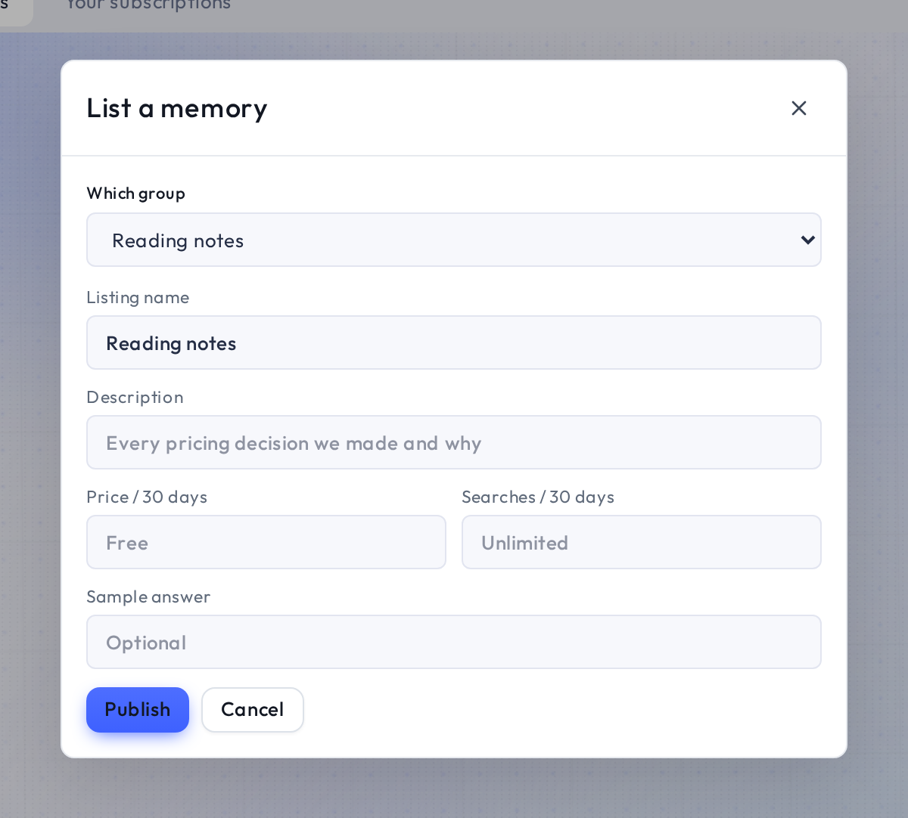

# Marketplace

The Marketplace has two parts, laid out the same way: **Skills** and **Memory**. Each has a
**Browse** tab for what others offer and a **Your …** tab for what you have published.

1. **Browse.** The catalog: every memory on the market, searchable, sorted by trending, most
   subscribed, most starred or name. Each card shows the seller, the price per 30 days, what the
   memory covers, and **Subscribe**.
2. **Your listings.** The memories you sell, with their subscribers. **List a memory** lives
   here.
3. **Your subscriptions.** The memories you bought.

The **Skills | Memory** switch above them picks the part of the market.

## Memory listings

A listing sells **live access to one of your memories**, not a copy. A subscriber's AI asks your
memory questions the same way your own connected apps do, through its own credential; it can
read only that memory, and never anything else in your account. The memory stays yours: you keep
editing it, and every subscriber sees the current state.

### Buying

Open a card to see **The memory** (the seller's description and the question it answers), a
**Sample recall**, and **What you get**. Then:

- **Subscribe free** or **Get it free** when the listing is free. No payment, cancel anytime.
- **Subscribe** for a paid listing. Payment is through your wallet; one payment is valid 30 days,
  and renewing is a new payment.

Once subscribed, the memory appears on your Memory page as a tile marked *Subscribed*. Its page
shows who sells it and when it renews, a **Read by** card to give it to one of your agents, and a
**Read from an app** card with the connector URL your AI app uses. **Your subscriptions** lists
them all, with **Issue credential** for an app and **Renew from the listing**.

> A subscription is live access. When the seller stops selling, your access stops immediately,
> even inside a paid period.

### Selling

1. Press **List a memory** (or **Sell** under *Marketplace* in the memory's own Settings).
2. Pick the memory under **Which group**, then fill in what buyers see: **Listing name**,
   **Listing description**, a **Sample answer**.
3. Set **Price / 30 days** (leave it empty for a free listing) and **Searches / 30 days** (how
   many questions one subscription may ask per period; empty means unlimited). A paid listing
   also asks for the wallet that receives payment.
4. Press **Publish**. A draft is not discoverable until you do.

**Your listings** shows each listing with its subscriber count and a **Delete**. Deleting a
listing revokes every subscriber's access immediately; the memory itself is untouched. The same
switch is **Stop selling** in the memory's Settings.

## Skills

Skills are packaged abilities an agent can use. **Browse** lists what others published, with
install and star; **Your skills** lists what you have installed or published. Trending is over the
last seven days.
