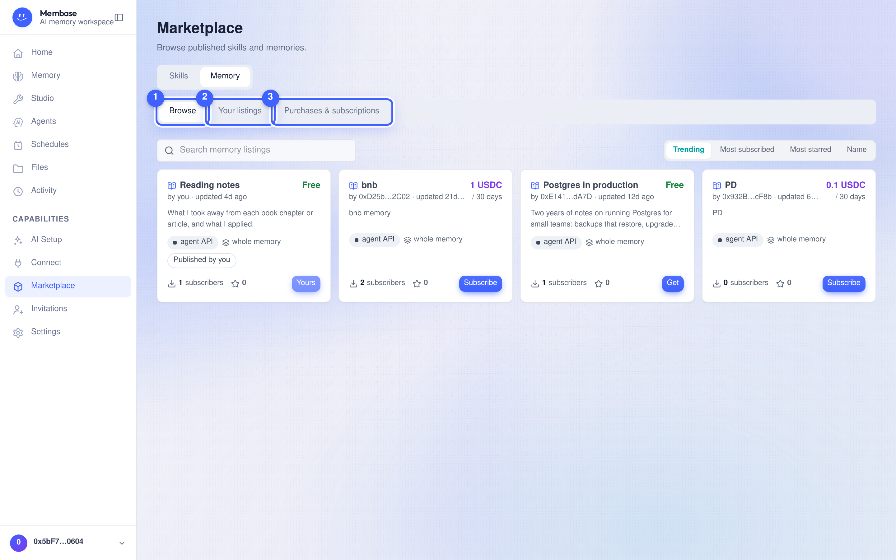
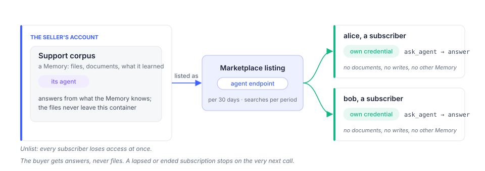
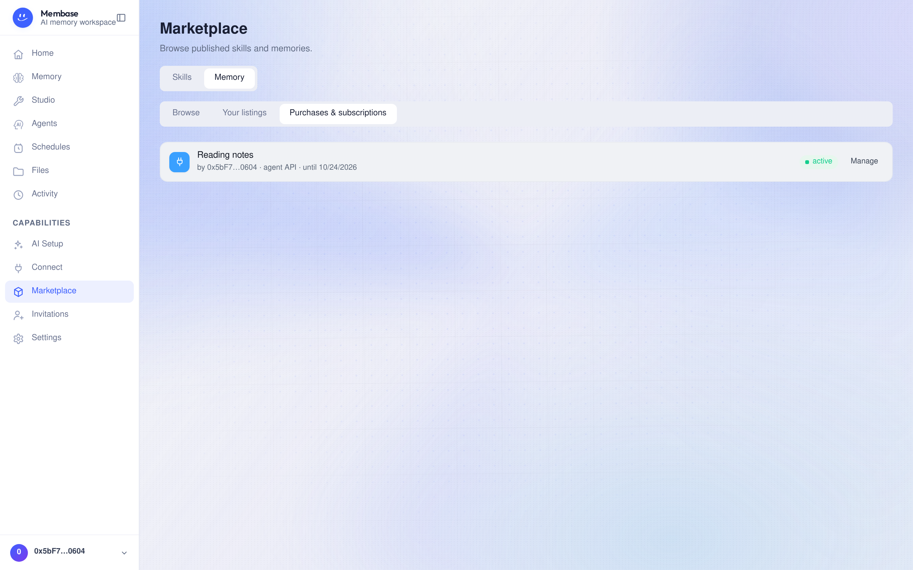
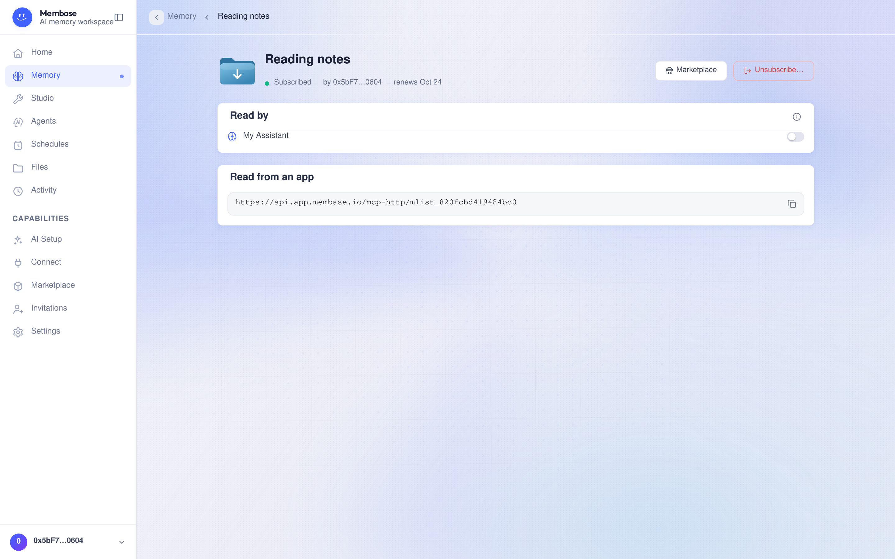
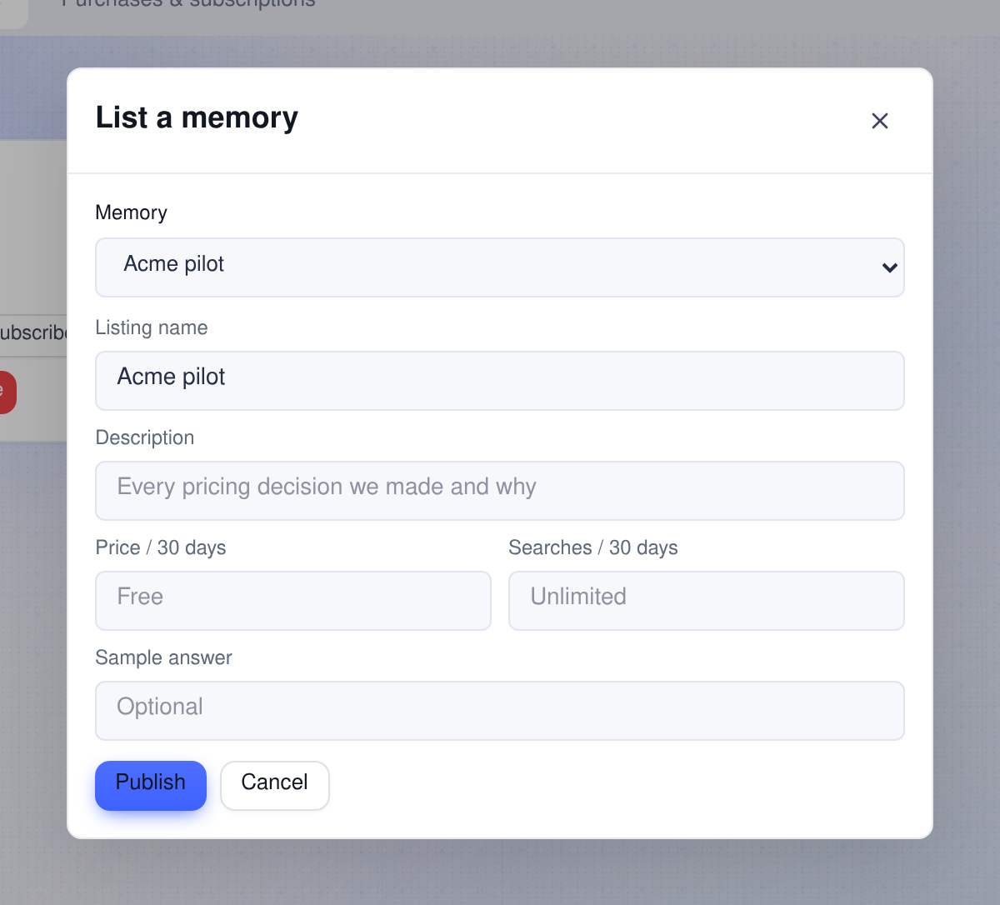

# Marketplace

Browse published skills and memories. Check the listing type, included access, price and
usage allowance before purchasing.

1. **Browse.** Search the catalog and open a listing to review its details.
2. **Your listings.** Manage the memories you offer. **List a memory** creates a listing.
3. **Purchases & subscriptions.** View purchased snapshots and live subscriptions.

The **Skills | Memory** switch selects the catalog.

## Memory listings

Listings can provide different kinds of access:

| Type | What you receive |
|---|---|
| Snapshot | A copy of the listed items at purchase time; later seller edits do not update it |
| Live memory | Read access to the seller's current memory while your subscription permits it |
| Agent endpoint | Access to an agent that answers through its published endpoint |

Open a listing and read **Included access** for its specific terms. Live access can be
revoked by the seller; a paid period does not guarantee access after the seller revokes it.

### Buying

Choose the purchase or subscription action shown on the listing. Review the confirmation,
including any usage limit. Paid listings open your wallet for payment; the purchase is
complete only after payment succeeds. Live paid access is valid for the period shown, and
renewal requires another payment.

Use **Purchases & subscriptions** to review status and access dates, open snapshot items,
or manage an available credential. Use the actions offered for that listing type.

A live memory subscription can also appear on your Memory page:

Its page shows the seller and access period. **Read by** selects which of your agents may
consult it. **Read from an app** provides connection details when available. You cannot edit
the seller's memory. Review the confirmation before unsubscribing.

### Selling

1. Select **List a memory**, or **Sell** from a Memory's settings.
2. Select the Memory and fill in the **Listing name**, **Description** and sample content.
3. Set the price and usage allowance. A paid listing requires a receiving wallet.
4. Review the details, then select **Publish** to make the listing discoverable.

Manage published listings under **Your listings**. Before deleting a listing or selecting
**Stop selling**, review how the action affects existing subscribers. Removing a listing
and deleting the Memory itself are separate actions.

## Skills

**Browse** lists published skills. **Your skills** lists installed or published skills.
Review a skill before installing it for use by an agent.
