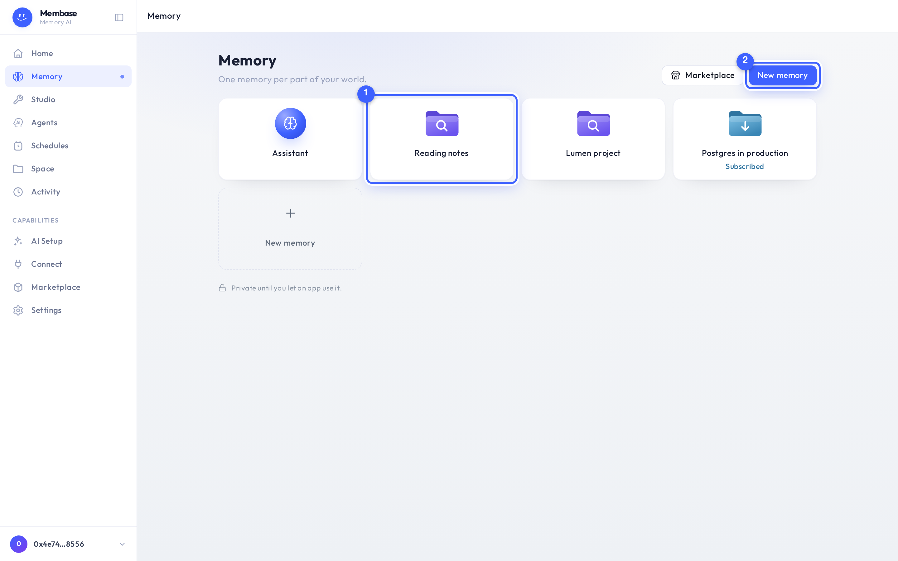
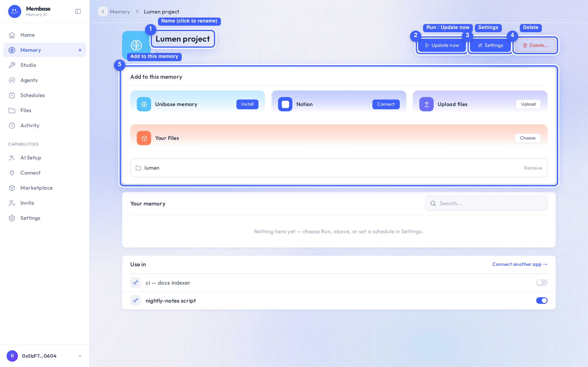
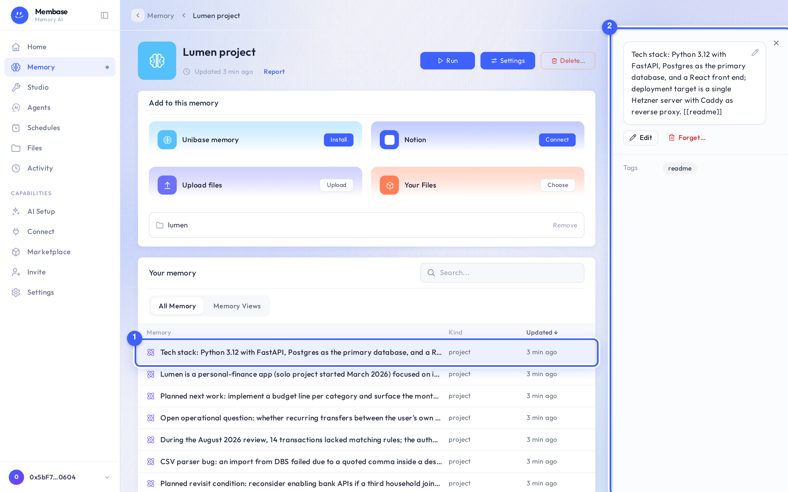
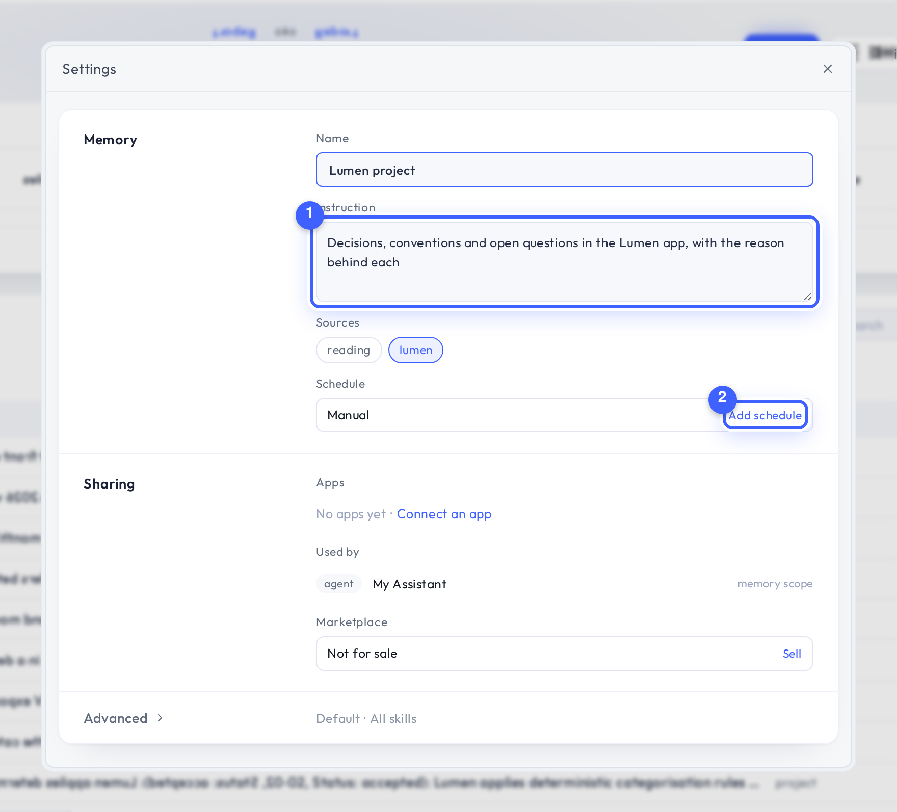
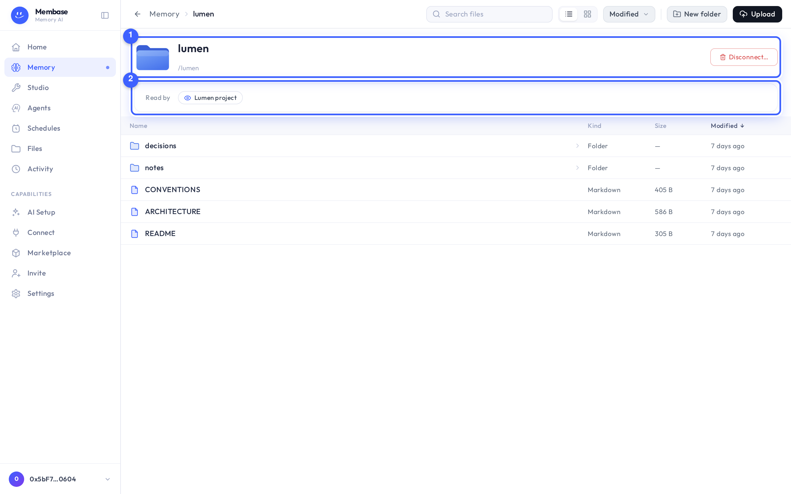

# Memory

The Memory page is one drive. Its root shows your memories as tiles; each memory opens as a page
with the same anatomy.

## The home page

1. **A memory tile.** Glyph, name, and a state word only when there is one: *Empty* (no
   instruction yet), *Add a source* (reads nothing yet), *On sale*, *Subscribed*.
2. **New memory.** Opens the New memory dialog. **Marketplace** beside it opens memories other
   people sell.

The Assistant's own memory is always the first tile. The home page reads nothing from the
memory itself, so it always opens instantly.

## A memory's page

1. **Name.** Click to rename in place.
2. **Run / Update now.** The one way to make the memory read its sources by hand. It says
   **Update now** while any source holds material the memory has not read. Disabled until the
   memory has a source.
3. **Settings.** The whole configuration as one dialog.
4. **Delete…** Says first the one irreversible thing (everything the memory learned goes with it),
   then what depends on it.
5. **Add to this memory.** Three doors: Unibase Memory, Upload Files, Your Space. Sources you
   added are listed under them with a **Remove** per row.

Under the Add card:

- **Your Memory.** What this memory currently knows: search, a kind filter, one list of pages
  and facts. Click an item to read it in the right column.
- **Use in.** One switch per app you have connected. **Connect an app** when there is none.

1. **An item.** One thing the memory keeps, with its kind and when it was last updated. The
   list is what the last run produced from the sources; nothing here was typed in by hand.
2. **The right column.** The item's full text, its tags, and **Edit** / **Forget…** for that
   one item.

### The status line

The line under the name is the memory's state and nothing else:

| It says | Meaning |
|---|---|
| *Nothing yet* | never run |
| *Checking…* | the page is reading the state |
| *Running…* | a run is queued or running; survives a reload |
| *Updated 3h ago · Report* | the last run read the current sources; **Report** opens what it did |
| *Run failed* | the last run failed; open the report, fix, run again |

"Unread" is decided by versions, not clocks. A sync that changed nothing, or a run on another
memory, cannot make this memory look up to date.

## Settings

Every field saves as it changes. There is no Save button.

1. **Instruction.** What the memory keeps. One field. For a memory over your conversations, it
   filters what the chats say, it is not a subject to write about.
2. **Schedule.** *Manual* until you add one. Cadences are picked, not typed: hourly, daily,
   weekly, monthly, or a custom cron. Times are in UTC; the picker shows your local equivalent.

Below: **Sharing** (apps as switches, what depends on this memory, Sell / Stop selling) and
**Advanced** (model, skills, its agent, **Open in Studio**).

## A source's page

Each source has its own page, reached from Settings › Sources or from the Add card.

1. **Hero.** The folder and its path, with **Disconnect…** as the one verb: a folder in your
   Space is read in place, so there is nothing to sync. A connector source (Unibase Memory)
   shows a status word here instead, and **Sync now**, **Reauthorize** or **Reconnect** when
   they apply.
2. **Read by.** Which memories learn from this source.

A folder source lists its files below, as an in-place workbench: open, rename, move, upload.
A conversation source lists its transcripts.

## If something looks wrong

Look up the word on screen.

### On the memory

| It says | What it means | Do |
|---|---|---|
| **Run** is disabled | the memory has no source yet, or its state is still loading | add a source; wait for *Checking…* to finish |
| *Update now* | a source holds material this memory has not read | press it |
| *Run failed* | the last run did not finish | open **Report**; usually the model source is off or a source needs reauthorization |
| *Nothing yet* | never run | press **Run** |
| *Empty* on the tile | no instruction | Settings › Instruction |
| *Add a source* on the tile | reads nothing yet | Add card |

### On a source

| It says | What it means | Do |
|---|---|---|
| *Queued* / *Syncing…* | fetching raw material | wait; the memory reads it on its next run |
| *Sync failed* | the last fetch failed | **Sync now**; if it repeats, the folder may have moved |
| *Needs reauthorization* | the source's own credential expired | **Reauthorize** |
| *Access revoked* / *Disconnected* | the source no longer grants access | **Reconnect** or remove it |

