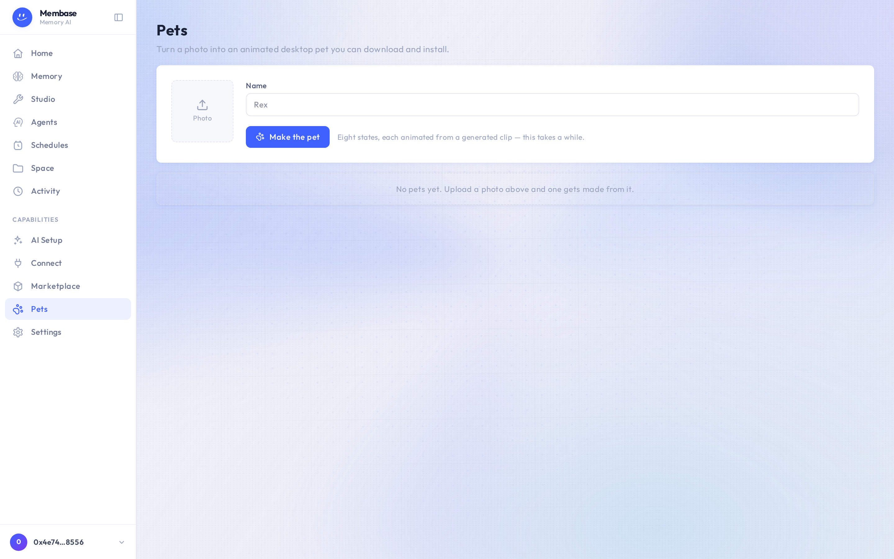

# Pets

Pets turns a photo into an animated desktop pet you can download and install.

1. Press **Photo** and pick a picture. Give the pet a **Name**.
2. Press **Make the pet**. Eight states are animated from a generated clip, so this takes a
   while; the pet appears in the list below when it is ready.
3. Download the pack and install it with the desktop app it names.

Pets is a self-contained capability: it does not read or write your memory.
