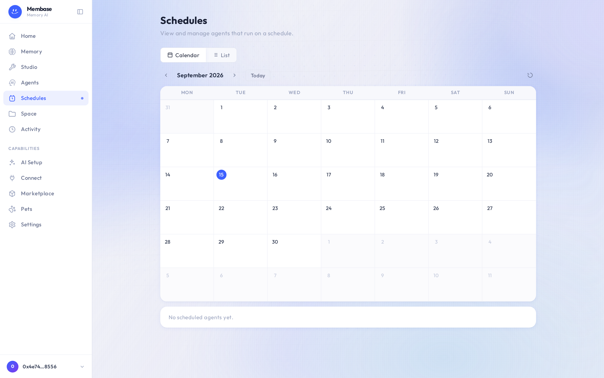

# Schedules

Every scheduled task in one place.

A memory's cadence, set in its Settings, appears here; so does any agent you put on a schedule.
Pause, resume or retune a live cadence here without touching the memory. Pausing is how a
schedule stops: a schedule has no delete verb, so the row says *paused* rather than pretending
it is gone.

Times are UTC. The picker shows your local equivalent.
