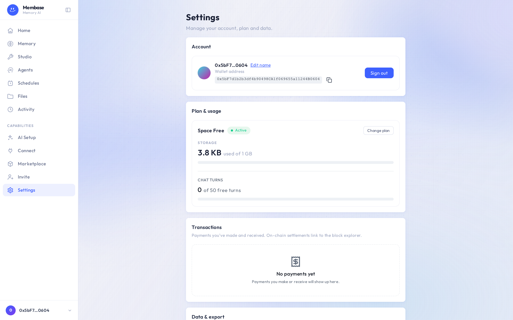

# Settings

Account, plan, payments, export and delete. Four sections, one page.

## Account

Who you are signed in as: your display name, the email or wallet you signed in with, and the
account identifier with a copy button. Support asks for that identifier; nothing else on this
card is needed anywhere.

## Plan & usage

Your Storage plan and how much of it you use: storage, and the metered actions your plan counts.
*Unlimited* on a line means the plan does not cap it.

- **Free** is the default and needs nothing.
- **Upgrading** is a wallet payment for a 30-day period. Press the plan, confirm the payment in
  your wallet, and the new limits apply at once. The card then says *Paid — plan active* with the
  date the period ends.
- **Renewal** happens at the end of the period the same way, as a new payment. If a renewal does
  not go through, the plan lapses to Free at the end of the paid period: nothing is deleted, but
  metered writes pause until you pay again.
- **Downgrading** is scheduled, not immediate: **Schedule downgrade** keeps the current plan until
  the paid period ends, then switches. **Keep current plan** cancels the scheduled change.
- **Cancel subscription** stops renewal now. You keep the period you have paid for.

## Transactions

Every payment this account has made: plan periods and marketplace subscriptions, with the date,
the amount and what it bought. *No payments yet* on a free account.

## Data & export

**Export account data** downloads a .zip of everything the account holds: your Files,
what your agent remembers, your memories and their settings, and the list of connected apps.
Use it before deleting, or just to keep a copy.

## Delete everything

The last row is the account itself. It asks twice and tells you exactly what goes:

- Your agent and everything it remembers.
- Every file in your Files, trash included.
- Sources and their credentials, revoked at once.
- Connected AI clients and their tokens.

Before it erases anything it offers **Download my data (.zip)**; **Continue without downloading**
skips that. Then you type the account identifier and press **Delete everything**. Connected
apps lose access immediately, marketplace subscribers of your memories lose theirs, and nothing
reappears afterwards.
