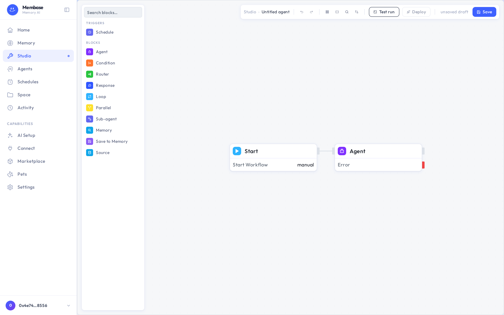

# Studio

Studio is the canvas where an agent is drawn. Most people reach it one way: a memory's
**Open in Studio**, under Advanced in its Settings. That opens the memory's own pipeline.

A memory has exactly one canvas. A fresh one holds two blocks, Start and the memory's agent, and
runs exactly what **Run** on the memory's page runs. On the canvas you can add what a button
cannot express: a Source block to read something else, a Recall block, a Save-to-Memory block, a
Condition, or a Schedule block.

Things that are the same object as on the memory's page:

- Renaming the memory renames its canvas and its agent.
- The Schedule block writes the same cadence as **Add schedule** in the memory's Settings and the
  row on the Schedules page.
- Deleting the memory archives its canvas.

**Save** keeps the draft your own runs execute. **Deploy** pins a version that schedules, webhooks
and marketplace subscribers run. The breadcrumb leads back to the memory.

You only need Studio for a memory that should do more than read its sources. If you are not sure
you need it, you do not.
